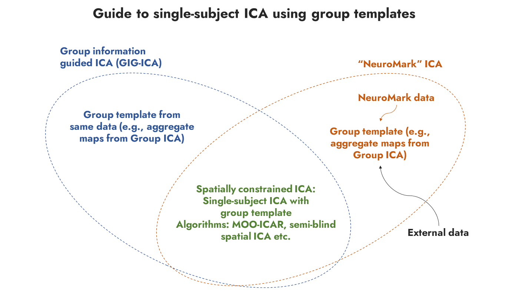

# About
This snippet of code can be used to estimate spatial maps and timecourses from a single-subject fMRI scan based on a reference template using the spatially constrained ICA algorithm. Can be used to run analysis in parallel on a large number of subjects or on a cluster, taking less than 2 minutes per subject.

# The Algorithms
* Spatially constrained ICA: algorithms that jointly maximize independence and similarity to a spatial template, we have two in the GIFT toolbox (MOO-ICAR & semi-blind spatial ICA)
* GIG-ICA: run group ICA and use aggregate maps as templates in spatially constrained ICA algorithm (MOO-ICAR was used in the original paper)
* NeuroMark ICA: take external neuromark template and run spatially constrained ICA (typically MOO-ICAR)

# To-do list
* Check if size of input and reference equal. if not, perform coregistration.

# References
* Du, Y., Fan, Y., 2013. Group information guided ICA for fMRI data analysis. NeuroImage 69, 157–197. https://doi.org/10.1016/j.neuroimage.2012.11.008
* Calhoun, V.D., 2004. GIFT Software [WWW Document]. URL https://trendscenter.org/software/gift/ (accessed 9.13.17).
